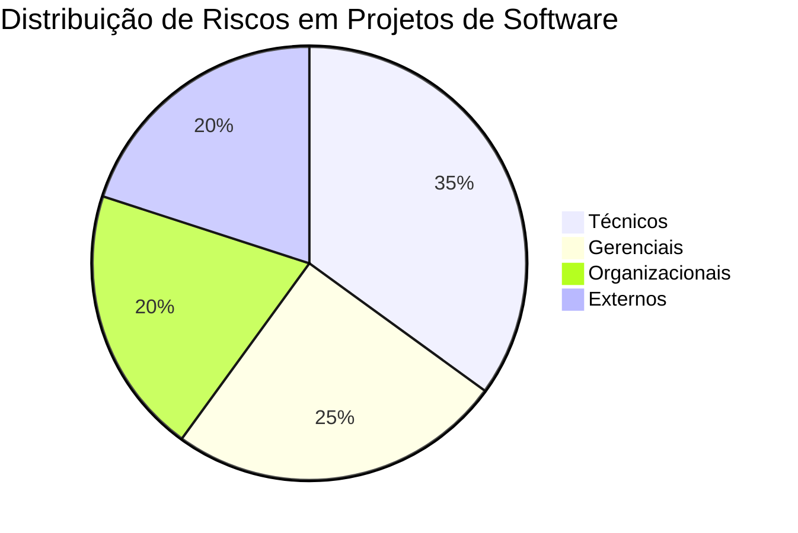

# 🚀 Projeto Acadêmico: Gerenciamento de Riscos em Projetos de Software


## 📋 Sobre o Projeto

Este repositório contém um projeto acadêmico completo sobre **Gestão de Riscos em Projetos de Software**, desenvolvido como parte da disciplina de Engenharia de Software. O projeto inclui documentação detalhada, um vídeo explicativo e exemplos práticos de identificação, análise e mitigação de riscos.

## 🎯 Objetivos

- 🔍 Identificar e classificar os principais riscos em projetos de software
- 📊 Apresentar metodologias de análise e avaliação de riscos
- 🛡️ Demonstrar estratégias de mitigação e resposta a riscos
- 💡 Fornecer um estudo de caso prático de aplicação

## 📂 Estrutura do Repositório

```
riscos-projetos-software/
│
├── 📄 documentacao/
│ ├── projeto-riscos-software.html # Documento principal em HTML
│ ├── projeto-riscos-software.pdf # Versão em PDF do documento
│ └── referencias.bib # Referências bibliográficas
│
├── 🎥 video/
│ ├── roteiro-video.md # Roteiro do vídeo explicativo
│ └── slides-apresentacao/ # Slides usados no vídeo
│
├── 📊 exemplos/
│ ├── matriz-riscos.xlsx # Template de matriz de riscos
│ ├── registro-riscos.csv # Exemplo de registro de riscos
│ └── estudo-caso/ # Material do estudo de caso
│
├── 📝 relatorio/
│ └── relatorio-tecnico.pdf # Relatório técnico completo
│
└── 📖 README.md # Este arquivo

```

## 📊 Matriz de Riscos (Exemplo)

| Categoria de Risco | Probabilidade | Impacto | Estratégia de Mitigação |
|-------------------|---------------|---------|-------------------------|
| Mudanças de requisitos | Alta | Alto | Processo formal de controle de mudanças |
| Falha na estimativa de tempo | Alta | Alto | Técnicas de estimativa baseadas em historical data |
| Problemas técnicos | Média | Alto | Prototipagem, revisões de código |
| Dependências externas | Média | Médio | Planos de contingência, múltiplos fornecedores |

## 🚦 Status do Projeto

- [x] Pesquisa teórica
- [x] Documentação principal
- [x] Estudo de caso
- [x] Template de matriz de riscos
- [ ] Gravação do vídeo explicativo
- [ ] Edição do vídeo

## 🛠️ Tecnologias Utilizadas

- **Documentação**: HTML5, CSS3, Markdown
- **Análise de dados**: Excel, CSV
- **Design**: Adobe Illustrator (para gráficos)
- **Edição de vídeo**: DaVinci Resolve
- **Versionamento**: Git/GitHub

## 📈 Gráfico de Distribuição de Riscos



# 📋 Tabela de Conteúdo do Documento

1 - Introdução

- Contextualização e objetivos

- Justificativa e importância do tema

2 - Revisão Teórica

- Conceitos fundamentais

- Frameworks de gerenciamento de riscos

3 - Classificação de Riscos

- Riscos técnicos

- Riscos de gerenciamento

- Riscos organizacionais

- Riscos externos

4 - Processo de Gerenciamento

- Identificação

- Análise qualitativa e quantitativa

- Planejamento de respostas

- Monitoramento e controle

5 - Estudo de Caso

- Contexto do projeto

- Riscos identificados

- Estratégias de mitigação

- Resultados alcançados

6 - Ferramentas de Apoio

- Software especializado

- Templates e planilhas

7 - Conclusões e Recomendações

# 🎥 Roteiro de Vídeo: Riscos em Projetos de Software

## 📋 Metadados do Vídeo

- **Título**: Gerenciamento de Riscos em Projetos de Software: Guia Completo
- **Duração**: 45 minutos
- **Formato**: Tutorial explicativo com slides, exemplos visuais e demonstrações
- **Público-alvo**: Estudantes de TI, gerentes de projeto, desenvolvedores

## 🎬 Estrutura e Timing do Vídeo

### Parte 1: Introdução (5 minutos)

**00:00 - 00:30** - Abertura com vinheta musical e título animado
**00:30 - 02:00** - Apresentação do tema e agenda do vídeo
**02:00 - 05:00** - Contextualização: Estatísticas sobre falhas em projetos de software

### Parte 2: Fundamentos Teóricos (10 minutos)

**05:00 - 08:00** - O que é risco? Diferença entre risco, problema e issue
**08:00 - 12:00** - Importância do gerenciamento de riscos no ciclo de vida do software
**12:00 - 15:00** - Framework teórico: PMBOK, CMMI, ISO 31000

### Parte 3: Classificação de Riscos (8 minutos)

**15:00 - 18:00** - Riscos Técnicos (tecnologia, complexidade, desempenho)
**18:00 - 20:00** - Riscos de Gerenciamento (escopo, tempo, custo)
**20:00 - 21:30** - Riscos Organizacionais (recursos, prioridades)
**21:30 - 23:00** - Riscos Externos (mercado, regulatórios, fornecedores)

### Parte 4: Processo de Gerenciamento de Riscos (12 minutos)

**23:00 - 26:00** - Identificação de Riscos (técnicas e ferramentas)
**26:00 - 30:00** - Análise Qualitativa (matriz probabilidade-impacto)
**30:00 - 33:00** - Análise Quantitativa (métodos estatísticos)
**33:00 - 35:00** - Planejamento de Respostas (evitar, transferir, mitigar, aceitar)

### Parte 5: Estudo de Caso Prático (7 minutos)

**35:00 - 38:00** - Apresentação do caso: Sistema de Gestão Acadêmica
**38:00 - 40:30** - Análise de riscos específicos e medidas de mitigação
**40:30 - 42:00** - Resultados alcançados e lições aprendidas

### Parte 6: Ferramentas e Conclusão (3 minutos)

**42:00 - 44:00** - Ferramentas de apoio (JIRA, planilhas, software especializado)
**44:00 - 45:00** - Conclusão final e call-to-action

---

## 🎨 Elementos Visuais Detalhados

### Seção 1: Introdução

- [ ] Vinheta de abertura com animação de risco/software
- [ ] Slide com título principal e subtítulo
- [ ] Gráfico animado do CHAOS Report (estatísticas de falhas)
- [ ] Apresentação do speaker (se aplicável)

### Seção 2: Fundamentos Teóricos

- [ ] Comparação visual: Risco vs Problema vs Issue
- [ ] Linha do tempo do ciclo de vida de desenvolvimento com pontos de risco
- [ ] Comparativo entre frameworks (PMBOK, CMMI, ISO 31000)

### Seção 3: Classificação de Riscos

- [ ] Infográfico com os 4 tipos de riscos
- [ ] Exemplos visuais para cada categoria:
  - Técnico: ícones de tecnologia, código, desempenho
  - Gerenciamento: ícones de calendário, orçamento, escopo
  - Organizacional: ícones de equipe, organização, prioridades
  - Externo: ícones de mercado, leis, fornecedores

### Seção 4: Processo de Gerenciamento

- [ ] Fluxograma animado do processo de gerenciamento de riscos
- [ ] Matriz de probabilidade-impacto interativa
- [ ] Demonstração de cálculo de exposição ao risco
- [ ] Exemplos visuais de estratégias de resposta

### Seção 5: Estudo de Caso

- [ ] Mockup do Sistema de Gestão Acadêmica
- [ ] Matriz de riscos preenchida para o caso
- [ ] Gráfico de antes/depois da implementação das mitigações
- [ ] Depoimento fictício do gerente do projeto (texto na tela)

### Seção 6: Ferramentas e Conclusão

- [ ] Screenshots das ferramentas mencionadas
- [ ] Slide de resumo dos pontos principais
- [ ] Call-to-action para material complementar
- [ ] Créditos finais

---

## 🎤 Script Detalhado

### Parte 1: Introdução (0:00-5:00)

**[00:00-00:30]**
(Música introdutória, animação de abertura)
"Bem-vindos ao nosso guia completo sobre gerenciamento de riscos em projetos de software!"

**[00:30-02:00]**
"Hoje vamos explorar uma das áreas mais críticas para o sucesso de projetos de TI. Ao longo dos próximos 45 minutos, vamos cobrir desde os fundamentos teóricos até aplicações práticas, com exemplos reais e ferramentas que você pode usar em seus projetos."

**[02:00-05:00]**
"Segundo o CHAOS Report do Standish Group, apenas 31% dos projetos de software são bem-sucedidos. Desses que falham, mais de 50% citam a má gestão de riscos como uma das causas principais. É sobre como evitar essas armadilhas que vamos falar hoje."

### Parte 2: Fundamentos Teóricos (5:00-15:00)

**[05:00-08:00]**
"Antes de tudo, precisamos entender: o que é risco? Risco é um evento ou condição incerta que, se ocorrer, tem um efeito positivo ou negativo nos objetivos do projeto. Diferente de um problema, que já aconteceu, ou uma issue, que é um ponto de atenção..."

**[Continuação do script...]**
(O script completo teria aproximadamente 45 minutos)

---

## 🛠️ Recursos Necessários

- [ ] Software de gravação de tela (OBS Studio, Camtasia)
- [ ] Software de edição (Adobe Premiere, DaVinci Resolve)
- [ ] Microfone de qualidade
- [ ] Slides preparados em PowerPoint/Google Slides
- [ ] Script impresso ou em teleprompter
- [ ] Exemplos visuais e gráficos preparados antecipadamente

---

## 📝 Notas de Produção

- Manter tom profissional mas acessível
- Incluir pausas naturais para respiração
- Usar transições suaves entre tópicos
- Inserir elementos visuais a cada 30-45 segundos
- Preparar versão com legendas para acessibilidade

Este roteiro fornece a estrutura completa para um vídeo de 45 minutos profissional e informativo sobre gerenciamento de riscos em projetos de software.

# 📝 Licença

Este projeto está sob a licença MIT. Veja o arquivo LICENSE para mais detalhes.

# ✨ Autores

Yriane de Morais & Waliston Euripedes

# 🎓 Instituição

<https://via.placeholder.com/150x50?text=Logo+Institui%C3%A7%C3%A3o>

Este projeto foi desenvolvido como parte do curso de Sistemas de Informação da Universidade Federal de Santa Maria.
